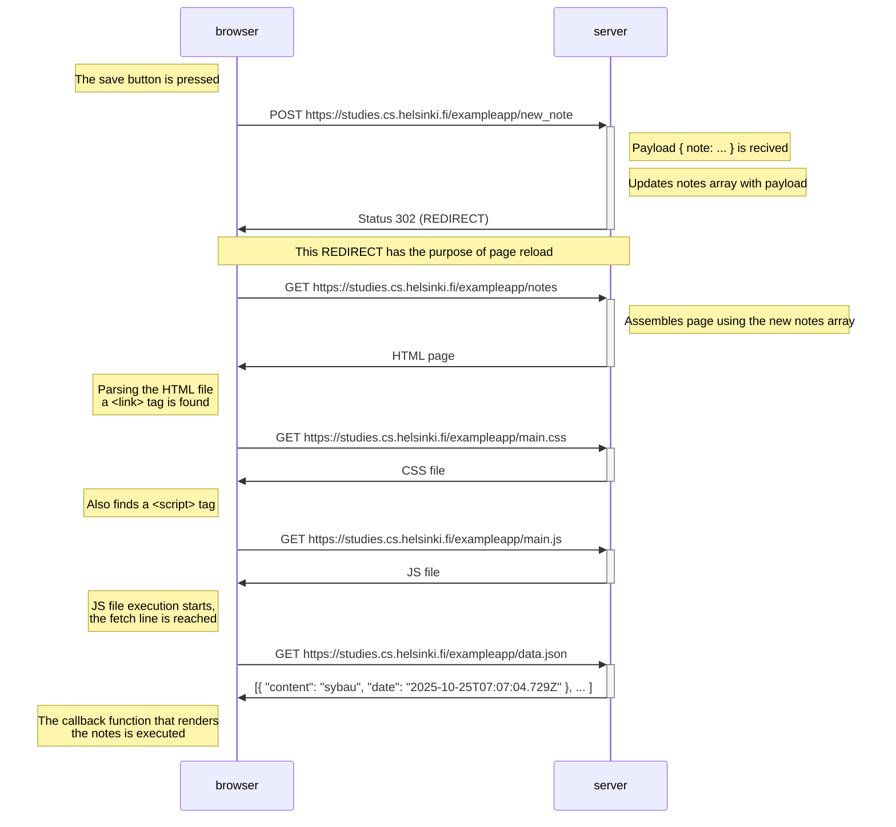

```mermaid
sequenceDiagram
    participant b as browser
    participant s as server

    note left of b: The save button is pressed
    b->>+s: POST https://studies.cs.helsinki.fi/exampleapp/new_note
    note right of s: Payload { note: ... } is recived
    note right of s: Updates notes array with payload

    s->>-b: Status 302 (REDIRECT)

    note over b,s: This REDIRECT has the purpose of page reload
    b->>+s: GET https://studies.cs.helsinki.fi/exampleapp/notes
    note right of s: Assembles page using the new notes array
    
    s->>-b: HTML page
    
    note left of b: Parsing the HTML file <br> a <link> tag is found
    b->>+s: GET https://studies.cs.helsinki.fi/exampleapp/main.css

    s->>-b: CSS file

    note left of b: Also finds a <script> tag
    b->>+s: GET https://studies.cs.helsinki.fi/exampleapp/main.js

    s->>-b: JS file
    note left of b: JS file execution starts, <br> the fetch line is reached

    b->>+s: GET https://studies.cs.helsinki.fi/exampleapp/data.json

    s->>-b: [{ "content": "sybau", "date": "2025-10-25T07:07:04.729Z" }, ... ]
    note left of b: The callback function that renders <br> the notes is executed
```
