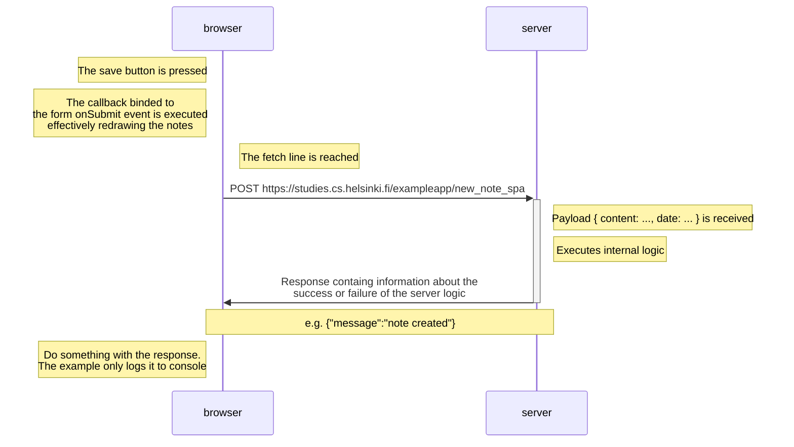

```mermaid
sequenceDiagram
    participant b as browser
    participant s as server

    note left of b: The save button is pressed
    note left of b: The callback binded to <br> the form onSubmit event is executed <br> effectively redrawing the notes
    note right of b: The fetch line is reached
    b->>+s: POST https://studies.cs.helsinki.fi/exampleapp/new_note_spa
    note right of s: Payload { content: ..., date: ... } is received
    note right of s: Executes internal logic

    s->>-b: Response containg information about the <br> success or failure of the server logic
    note over b,s:  e.g. {"message":"note created"}
    note left of b: Do something with the response. <br> The example only logs it to console
```
