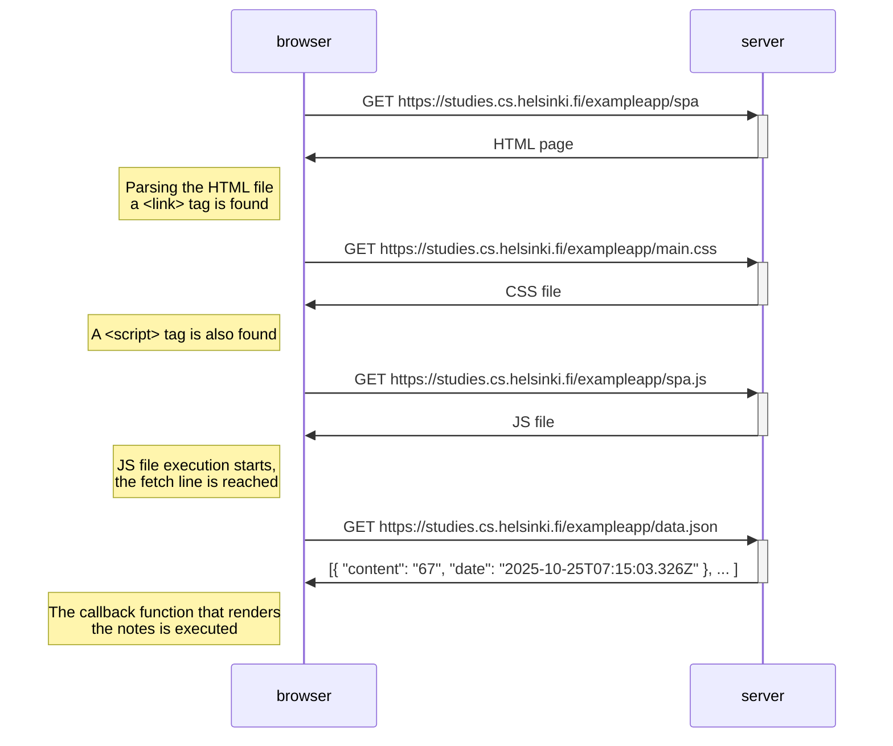

```mermaid
sequenceDiagram
    participant b as browser
    participant s as server

    b->>+s: GET https://studies.cs.helsinki.fi/exampleapp/spa
    
    s->>-b: HTML page
    
    note left of b: Parsing the HTML file <br> a <link> tag is found
    b->>+s: GET https://studies.cs.helsinki.fi/exampleapp/main.css

    s->>-b: CSS file

    note left of b: A <script> tag is also found
    b->>+s: GET https://studies.cs.helsinki.fi/exampleapp/spa.js

    s->>-b: JS file
    note left of b: JS file execution starts, <br> the fetch line is reached

    b->>+s: GET https://studies.cs.helsinki.fi/exampleapp/data.json

    s->>-b: [{ "content": "67", "date": "2025-10-25T07:15:03.326Z" }, ... ]
    note left of b: The callback function that renders <br> the notes is executed
```
